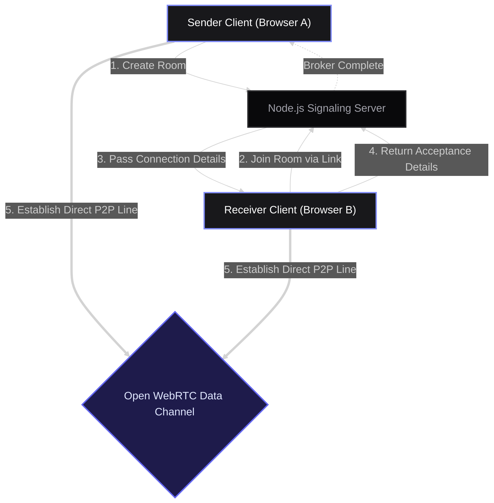
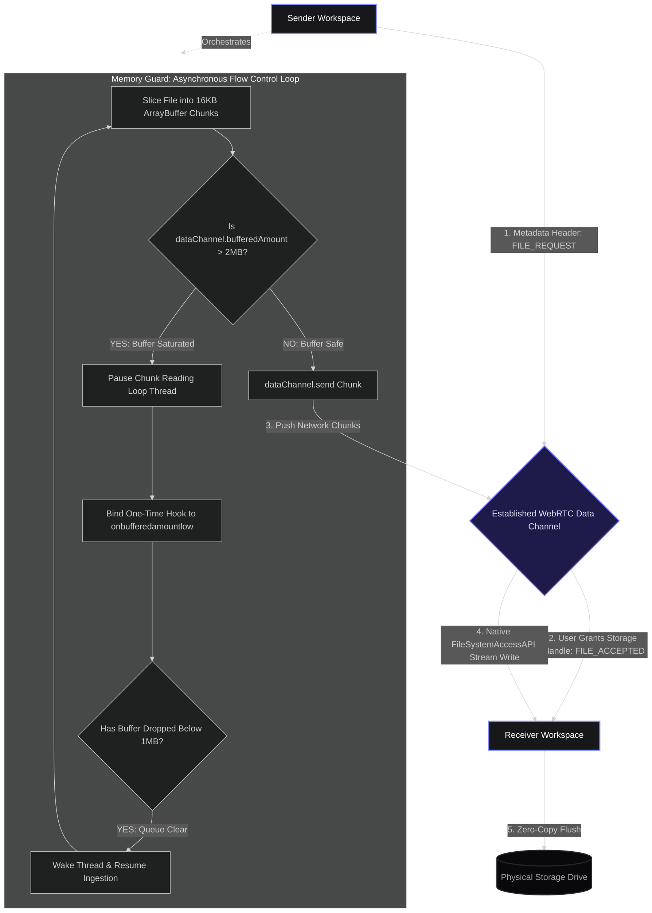

# Ronin P2P

High-performance, zero-intermediary peer-to-peer data pipeline engineered to stream multi-gigabyte files directly between desktop viewports.

[](https://webrtc.org/)
[](https://socket.io/)
[](https://react.dev/)
[](https://tailwindcss.com/)
[](LICENSE)

---

## Technical Overview

Ronin P2P addresses the persistent latency and storage overhead found in traditional web file-sharing platforms. By eliminating the standard upload-then-download loop common to centralized cloud applications and communication tools, the system constructs a direct, browser-to-browser communication bridge. 

The architecture is explicitly optimized for heavy desktop assets (such as raw video masters, database dumps, and archive sets). The underlying engine leverages native browser low-level APIs to write incoming chunks directly to disk storage, bypassing volatile process RAM and eliminating out-of-memory web application crashes during large transfers.

---
## System System Architecture & Data Flow Pipeline
## System Architecture & Data Flow Pipeline

### Phase 1: Signaling & Connection Handshake



### Phase 2: High-Velocity Streaming & Asynchronous Backpressure Control


---

## Core Engineering Implementations

### 1. Asynchronous Sliding-Window Backpressure Control
Unregulated network transmission loops running inside single-threaded JavaScript runtimes quickly saturate system network sockets. If the memory ingestion rate outpaces the hardware network interface card's ability to dispatch buffers, the application throws a critical channel overflow error.

Ronin P2P resolves queue saturation by managing memory boundaries via a strict high-to-low watermark structure:

| Architectural Component | Allocation Metric | Structural Objective |
| :--- | :--- | :--- |
| **Data Chunk Slice** | 16,384 Bytes (16KB) | Ideal safe buffer packet volume across desktop radios. |
| **High Watermark Ceiling** | 2,097,152 Bytes (2MB) | Buffer volume safety limit to pause loop ingestion. |
| **Low Watermark Threshold** | 1,048,576 Bytes (1MB) | Low buffer queue alarm to wake and resume chunk reading. |

The execution loop tracks the data channel's internal `bufferedAmount`. When the queue exceeds the 2MB high watermark ceiling, the processing engine halts execution using an explicit asynchronous Promise. It binds a one-time callback hook to `onbufferedamountlow` (calibrated to the 1MB low watermark threshold). The streaming loop remains asleep until the browser radio flushes the socket queue past the threshold line, safely clearing congestion.

### 2. Zero-Copy Direct-to-Disk Piling
Standard web applications aggregate incoming file packets inside memory arrays (like blobs or heap arrays) before instigating a programmatic link click to drop the file down to the machine. For multi-gigabyte files, this process exhausts the browser's maximum heap limit, triggering an immediate tab crash.

* **Chromium Stream Access:** On supported Chromium engines, the system invokes `window.showSaveFilePicker` to acquire a secure hardware file handle before transmission begins.
* **Low-Level Disk Pipes:** Incoming 16KB `ArrayBuffer` pieces are immediately passed to an active `FileSystemWritableFileStream`. The runtime writes the network buffer block directly to the sector blocks of the disk, maintaining a completely flat process memory ceiling.

### 3. Rendering Engine & Hardware Optimization
* **Event Loop Throttle:** Redrawing progress bars or updating status strings inside rapid loops chokes the React virtual DOM layout tree. Ronin P2P implements explicit tracking logic that restricts state execution strictly to integer percentage step increments. This shifts UI draw operations from over 10,000 updates down to a maximum cap of 100 per transfer, leaving the execution thread entirely open for networking logic.
* **System Sleep Failguard:** Large-scale workflows are protected from operating system suspension using the native Screen Wake Lock API (`navigator.wakeLock`). The sender application demands an execution priority lock that blocks power-saving sleep configurations from shutting down CPU clock cycles or network radios mid-stream.
* **Network Circuit Breaker:** The system loop checks the active connectivity status on every slice cycle. If the peer connection transitions to a `failed` state or the data channel drops out of an `open` state, the circuit breaker instantly trips—closing file descriptors, releasing wake locks, and stopping memory leaks.

---

## Architecture Engine Constraints

* **Chromium Targets:** Workstation optimization requires native `FileSystemAccessAPI` integration. Full direct-to-disk streaming functionality is available on Chrome, Brave, and Edge.
* **Firefox Fallback Integration:** Firefox lacks support for direct-to-disk stream pipes. To preserve cross-browser interoperability, the engine implements an automated fallback cache. Firefox ingestion streams directly into a memory allocation buffer up to a structural safetynet ceiling of 200MB. Payloads larger than 200MB on Firefox trigger a warning modal advising the user to migrate to a Chromium engine.

---

## Tech Stack Overview

### Frontend Workspace
* **React:** Core component state layout tracking.
* **Vite:** High-performance local development build toolchain.
* **Tailwind CSS:** Contextual, typography-centric user interface console styling.
* **Three.js / React Three Fiber:** Native hardware-accelerated globe asset presentation layer.

### Infrastructure Layer
* **WebRTC API:** Handles physical connection handshakes, ICE coordinate tracking, and high-speed data piping.
* **Node.js & Socket.io:** Real-time signaling gateway framework deployed to cloud infrastructure.

---

## Local Development & Setup

Follow these commands to deploy the project architecture locally:

### Prerequisites
Ensure you have Node.js installed on your machine.

### Setup Instructions

```bash
# 1. Clone the repository structure
git clone [https://github.com/yourusername/roninp2p.git](https://github.com/yourusername/roninp2p.git)

# 2. Access the project root folder
cd roninp2p

# 3. Install core dependencies
npm install

# 4. Initiate the localized dev workspace
npm run dev

---

## Developed By
```

Built by **[vasanth642]**  
🔗 GitHub: [@vasanth642](https://github.com/vasanth642)

---

## Support the Project

If this project helped you understand peer-to-peer streaming or accelerated your development workflow, please consider giving it a star! It helps others discover the repository.

⭐ **Star this repository**
